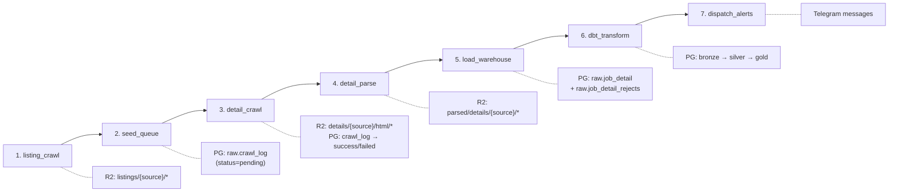
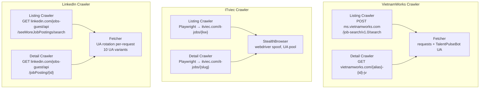
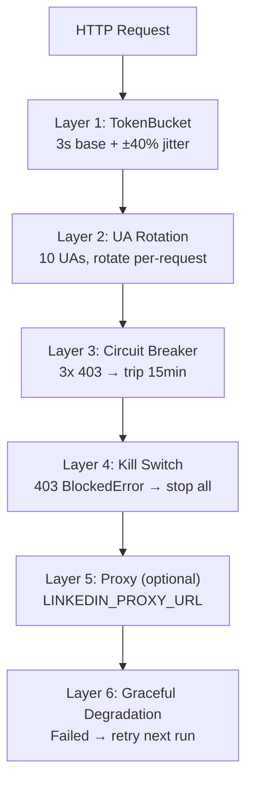
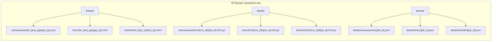
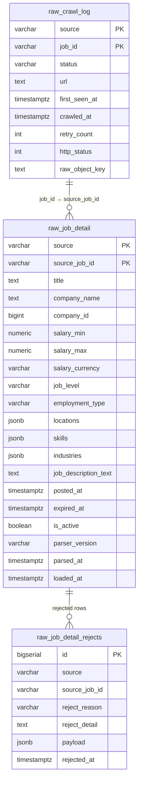
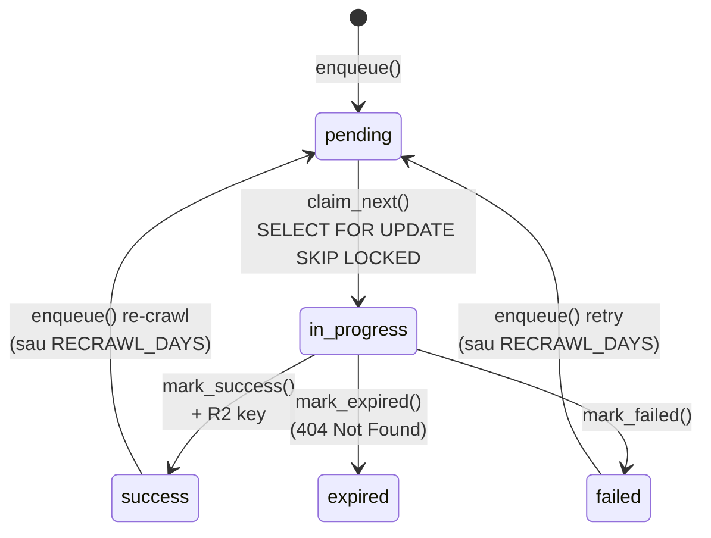
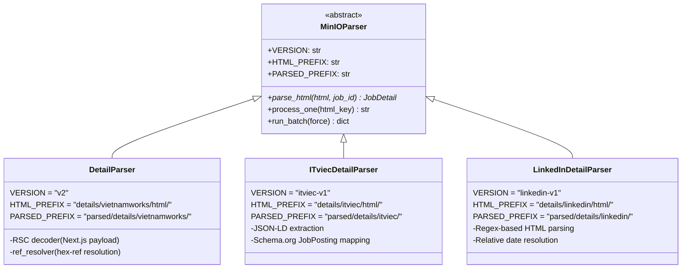
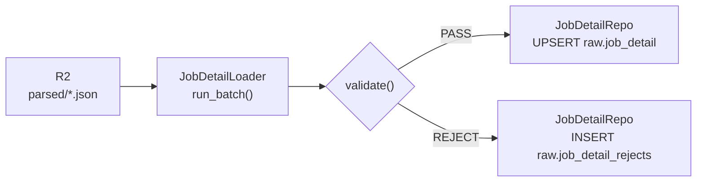
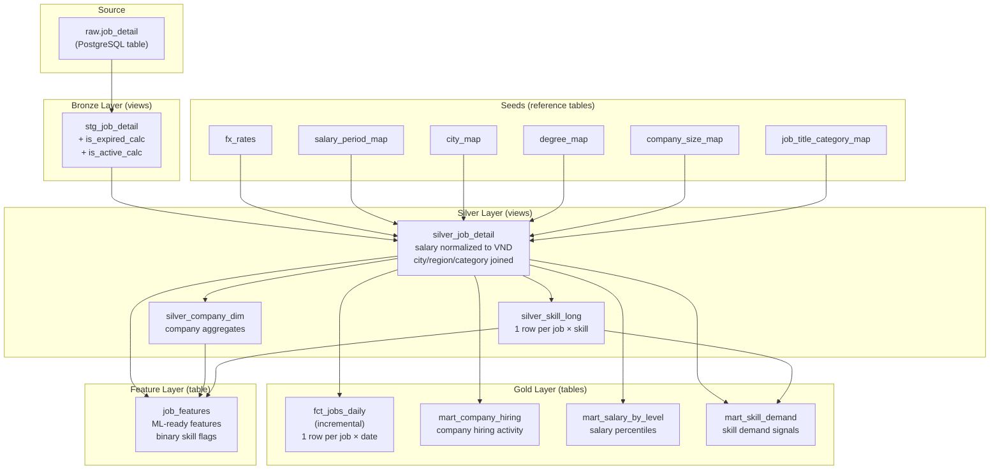
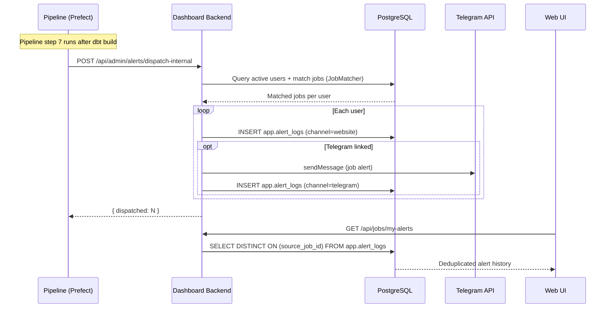

# TalentPulse Pipeline — Component Reference

**This is the component-level document: what is inside the crawlers, the queue, the
parsers, the loaders, the dbt models and the alert system.**

For the system level — how the two boxes fit together, where compute actually runs,
scheduling, backup, network — read **[architect.md](architect.md)** first. This file
deliberately does not repeat it.

> Previously `ARCHITECTURE.md`. Renamed because two files with near-identical names,
> both claiming to be "the architecture", is how people end up reading the wrong one.
> Its three system-level chapters described the retired 8-container / MinIO layout
> and have been removed — `architect.md` owns that ground now.

## Table of Contents

- [Pipeline Flow (End-to-End)](#pipeline-flow-end-to-end)
- [Crawlers](#crawlers)
- [Storage Layer](#storage-layer)
- [Queue System](#queue-system)
- [Parsers](#parsers)
- [Loaders & Validators](#loaders--validators)
- [dbt Transform (Bronze → Silver → Gold)](#dbt-transform-bronze--silver--gold)
- [Alert System](#alert-system)
- [Directory Structure](#directory-structure)

---
## Pipeline Flow (End-to-End)

Mỗi source chạy cùng một flow 7 bước. Ba pipeline chạy staggered để tránh overload:

| Pipeline | Cron | Giờ chạy |
|----------|------|----------|
| VietnamWorks | `0 2 * * *` | 02:00 AM |
| ITviec | `0 4 * * *` | 04:00 AM |
| LinkedIn | `0 6 * * *` | 06:00 AM |



### Chi tiết từng bước

| # | Stage | Input | Output | Mô tả |
|---|-------|-------|--------|-------|
| 1 | **listing_crawl** | Keywords từ config | R2 `listings/` + list job IDs | Crawl danh sách job từ search page |
| 2 | **seed_queue** | Job IDs từ step 1 | `raw.crawl_log` rows | Enqueue job IDs vào work queue, skip nếu đã crawl < 7 ngày |
| 3 | **detail_crawl** | `crawl_log` pending rows | R2 `details/.../html/*.gz` | Fetch HTML chi tiết từng job, gzip lưu R2 |
| 4 | **detail_parse** | R2 raw HTML files | R2 `parsed/details/*.json` | Parse HTML → JSON (JobDetail schema ~50 fields) |
| 5 | **load_warehouse** | R2 parsed JSON | `raw.job_detail` table | Validate + UPSERT vào PostgreSQL |
| 6 | **dbt_transform** | `raw.job_detail` | bronze/silver/gold tables | Normalize salary, join lookups, build marts |
| 7 | **dispatch_alerts** | silver layer + dashboard API | Telegram messages | Call dashboard API to match jobs with user profiles and send alerts |

---

## Crawlers

### So sánh 3 crawlers

| | VietnamWorks | ITviec | LinkedIn |
|---|---|---|---|
| **Method** | `requests` (HTTP POST) | Playwright Chromium | `requests` (HTTP GET) |
| **Listing API** | JSON search API | HTML scraping + JSON-LD | Public guest HTML API |
| **Detail API** | HTML page (Next.js RSC) | HTML page (JSON-LD) | Public guest HTML API |
| **Rate limit** | 2.5s/req | 8s dwell + random | 3.0s/req |
| **Anti-block** | Polite UA, circuit breaker | Stealth browser, cookie clear | UA rotation/req, circuit breaker |
| **Proxy** | No | No | Optional (`LINKEDIN_PROXY_URL`) |
| **Docker image** | ~500MB (pip only) | ~1.5GB (Playwright) | ~500MB (pip only) |
| **Volume/run** | ~300 jobs | ~50 jobs | ~800-1200 jobs |



### Anti-Block Defense (LinkedIn)



**Retry backoff:**

| Status | VietnamWorks | LinkedIn |
|--------|-------------|----------|
| 429 (rate limit) | [30, 60, 120]s | [60, 120, 300]s |
| 999 (LinkedIn custom) | N/A | [60, 120, 300]s |
| 403 (blocked) | Kill switch | Kill switch |
| 5xx | [5, 15, 45]s | [5, 15, 45]s |

---

## Storage Layer

### Cloudflare R2 (Object Storage)

> Was R2 until 2026-07-06. The bucket name and key layout below are
> unchanged — only the backend moved. `src/storage/minio_client.py` keeps its
> old class name but speaks S3 to R2.

Bucket: `talentpulse-raw`



### PostgreSQL Schema

Database `warehouse` chứa 2 schema chính:



---

## Queue System

`raw.crawl_log` hoạt động như một work queue với atomic claim:



**Freshness check**: `enqueue()` sẽ skip nếu job đã crawl thành công trong vòng `CRAWLER_RECRAWL_DAYS` (default: 7 ngày).

**Seeders** (populate queue cho từng source):

| Source | Seeder | Input | URL Pattern |
|--------|--------|-------|-------------|
| VietnamWorks | `src/queue/seeder.py` | Listing JSON từ R2 | `https://www.vietnamworks.com/{alias}-{id}-jv` |
| ITviec | `src/queue/itviec_seeder.py` | URL list | `https://itviec.com/it-jobs/{slug}-{id}` |
| LinkedIn | `src/queue/linkedin_seeder.py` | Job ID list | `https://www.linkedin.com/jobs/view/{id}` |

---

## Parsers

Cả 3 parser đều extend `MinIOParser` (abstract base) và output cùng `JobDetail` dataclass (~50 fields).



### Parse flow

```
R2 (.html.gz) → decompress → parse_html() → JobDetail dataclass → serialize → R2 (.json)
```

### Parse strategy per source

| Source | Technique | Tại sao |
|--------|-----------|---------|
| VietnamWorks | RSC (React Server Components) decoder | Page dùng Next.js, data nằm trong `self.__next_f.push()` chunks |
| ITviec | JSON-LD `<script type="application/ld+json">` | Page có structured data Schema.org/JobPosting |
| LinkedIn | Regex on HTML classes | Public guest API trả HTML fragments, class names ổn định |

---

## Loaders & Validators

### Load flow



### Validation rules

| Rule | Code | Mô tả |
|------|------|-------|
| `MISSING_TITLE` | `title is None or empty` | Job phải có title |
| `MISSING_COMPANY` | `company_name is None or empty` | Job phải có company |
| `BAD_SALARY_RANGE` | `is_salary_visible AND salary_min > salary_max` | Min phải <= Max |
| `BAD_DATE_RANGE` | `expired_at < posted_at` | Ngày hết hạn phải sau ngày đăng |
| `OUT_OF_FOCUS` | Function ID not in {25,27,129,130} AND title not match FOCUS_KEYWORDS | Chỉ áp dụng cho VietnamWorks (ITviec & LinkedIn skip) |

### UPSERT logic

```sql
INSERT INTO raw.job_detail (...) VALUES (...)
ON CONFLICT (source, source_job_id)
DO UPDATE SET ... WHERE raw.job_detail.parsed_at <= EXCLUDED.parsed_at
```

Newer parse always wins — nếu `parsed_at` mới hơn thì overwrite, nếu cũ hơn thì skip.

---

## dbt Transform (Bronze → Silver → Gold)

### Layer Architecture



### Bronze: `stg_job_detail` (view)

Pass-through từ `raw.job_detail`, thêm 2 computed columns:

```sql
-- expired_at là single source of truth cho is_active
is_expired_calc = expired_at IS NOT NULL AND expired_at < current_timestamp
is_active_calc  = NOT is_expired_calc  -- (inverse)
```

Tại sao không dùng raw `is_active`? Vì parser của ITviec từng hardcode `is_active=True` gây bug 13/199 jobs active trên prod. Giờ dùng `expired_at` làm source of truth duy nhất.

### Silver: `silver_job_detail` (view)

Chuẩn hóa và enrich data:

| Transform | Logic |
|-----------|-------|
| **Salary → VND monthly** | `salary × fx_rate × months_multiplier` (join `fx_rates` + `salary_period_map`) |
| **City canonical** | `locations->0->>'city'` → join `city_map` → `city_canonical` + `region` (North/Central/South) |
| **Job category** | `LOWER(title) LIKE '%keyword%'` → join `job_title_category_map` (priority-ordered, first match wins) |
| **Company size** | `company_size_id` → join `company_size_map` → `size_label` + `size_bucket` |
| **Degree** | `highest_degree_id` → join `degree_map` → `degree_label` |
| **is_active/is_expired** | Từ bronze `is_active_calc` / `is_expired_calc` |

### Silver: `silver_company_dim` (view)

Aggregate per `company_id`: latest snapshot + counts + averages.

### Silver: `silver_skill_long` (view)

UNNEST `skills` JSONB array → 1 row per (job × skill). Dùng cho skill analytics.

### Gold Layer (tables — rebuilt mỗi dbt run)

| Model | Grain | Materialization | Mục đích |
|-------|-------|-----------------|----------|
| `fct_jobs_daily` | `(source, source_job_id, snapshot_date)` | **incremental** | Fact table chính — 1 row per job per day. Track lifecycle (views growth, salary drift, active→expired). |
| `mart_company_hiring` | `company_id` | table | Company hiring dashboard: n_jobs, avg salary, primary city |
| `mart_salary_by_level` | `(job_category, job_level, city, region)` | table | Salary percentiles (P25/P50/P75) by level × city |
| `mart_skill_demand` | `skill_name_norm` | table | Skill demand: n_jobs, % of total, avg salary per skill |

### Feature Layer

| Model | Grain | Mục đích |
|-------|-------|----------|
| `job_features` | `source_job_id` | ML feature store — binary skill flags, salary target, engagement signals. Future: Feast PostgresSource |

**Feature columns:**
- Binary: `has_python`, `has_sql`, `has_aws_cloud`, `has_ml_ai`, `has_bigdata`, `has_bi_tool`
- Numeric: `n_skills`, `salary_vnd_monthly_avg`, `num_of_views`, `num_of_applications`, `days_since_posted`
- Categorical: `is_senior`, `is_remote`, `job_level`, `city_canonical`, `region`, `degree_label`, `company_size_bucket`

### dbt Seeds (reference data)

| Seed | Rows | Key → Value |
|------|------|-------------|
| `fx_rates.csv` | 3 | VND=1, USD=25000, JPY=165 |
| `salary_period_map.csv` | 4 | Monthly=1x, Hourly=176x, Yearly=0.083x |
| `city_map.csv` | 13 | VNW/ITviec city names → canonical + region |
| `degree_map.csv` | 14 | IDs 0-13 → "Not Required" through "PhD" |
| `company_size_map.csv` | 11 | IDs 0-10 → size labels + buckets |
| `job_title_category_map.csv` | 29 | keyword → category (priority-ordered) |

### dbt Execution Order

```bash
dbt seed                                    # Load reference CSVs
dbt run --exclude fct_jobs_daily            # Run all non-incremental models
dbt run --select fct_jobs_daily --full-refresh  # Full refresh fact table
```

---

## Alert System

Alerts are handled by the **Dashboard Backend API**, not by the pipeline itself.

The pipeline's only responsibility is to call the dashboard API after data is fresh:



### Key points

- Pipeline flows call `dispatch_dashboard_alerts()` in `_shared.py` which POSTs to the dashboard API
- Dashboard backend runs its own background alert loop (slot-based, 7:30-21:30 VN time)
- Matching uses `JobMatcher` with scoring: title 40%, city 25%, salary 20%, skills 15%
- Dedup via `app.alert_logs` with unique constraint `(user_id, source_job_id, channel)`
- Users manage preferences via web UI (/profile), Telegram linking via deep link

---


## Directory Structure

```
pipeline_data/
├── src/
│   ├── crawlers/
│   │   ├── browser.py              # Playwright stealth browser (ITviec)
│   │   ├── vietnamworks/
│   │   │   ├── listing.py          # VNW listing crawler (requests)
│   │   │   └── detail/
│   │   │       ├── detail_crawler.py
│   │   │       ├── fetcher.py
│   │   │       └── url_builder.py
│   │   ├── itviec/
│   │   │   ├── listing.py          # ITviec listing crawler (Playwright)
│   │   │   └── detail.py           # ITviec detail crawler (Playwright)
│   │   └── linkedin/
│   │       ├── listing.py          # LinkedIn listing crawler (requests)
│   │       ├── detail.py           # LinkedIn detail crawler (requests)
│   │       ├── fetcher.py          # HTTP fetcher + retry + block detection
│   │       └── user_agents.py      # 10 UA variants, rotate per-request
│   ├── parsers/
│   │   ├── base.py                 # MinIOParser abstract base class
│   │   ├── vietnamworks/detail/
│   │   │   ├── detail_parser.py    # RSC decoder parser
│   │   │   ├── rsc_decoder.py      # Next.js RSC payload decoder
│   │   │   ├── ref_resolver.py     # Hex-ref resolver
│   │   │   ├── html_cleaner.py     # HTML → plain text
│   │   │   └── schema.py          # JobDetail dataclass (~50 fields)
│   │   ├── itviec/
│   │   │   └── detail_parser.py    # JSON-LD parser
│   │   └── linkedin/
│   │       └── detail_parser.py    # Regex HTML parser
│   ├── queue/
│   │   ├── seeder.py               # VNW queue seeder
│   │   ├── itviec_seeder.py        # ITviec queue seeder
│   │   └── linkedin_seeder.py      # LinkedIn queue seeder
│   ├── loaders/
│   │   ├── job_detail_loader.py    # R2 → validate → PG upsert
│   │   └── validators.py           # 5 rejection rules
│   ├── storage/
│   │   ├── db.py                   # psycopg2 connection manager
│   │   ├── crawl_log.py            # Work queue ORM
│   │   ├── job_detail_repo.py      # UPSERT + rejects ORM
│   │   └── minio_client.py         # boto3 S3 wrapper
│   ├── normalizer/
│   │   ├── runner.py               # Normalization engine runner
│   │   ├── models.py               # Normalization data models
│   │   └── matchers/
│   │       └── category.py         # Job category normalization
│   └── utils/
│       ├── config.py               # Centralized env config
│       ├── circuit_breaker.py      # Window-based circuit breaker
│       ├── rate_limiter.py         # TokenBucket + jitter
│       └── safety.py               # Kill switch
├── dbt_transform/
│   ├── models/
│   │   ├── bronze/stg_job_detail.sql
│   │   ├── silver/
│   │   │   ├── silver_job_detail.sql
│   │   │   ├── silver_company_dim.sql
│   │   │   └── silver_skill_long.sql
│   │   ├── gold/
│   │   │   ├── fct_jobs_daily.sql      (incremental)
│   │   │   ├── mart_company_hiring.sql
│   │   │   ├── mart_salary_by_level.sql
│   │   │   └── mart_skill_demand.sql
│   │   └── features/job_features.sql
│   └── seeds/
│       ├── city_map.csv
│       ├── fx_rates.csv
│       ├── salary_period_map.csv
│       ├── degree_map.csv
│       ├── company_size_map.csv
│       └── job_title_category_map.csv
├── orchestration/
│   ├── flows/
│   │   ├── _shared.py              # run_dbt() + dispatch_alerts()
│   │   ├── vnw_pipeline.py         # 7-task VNW flow
│   │   ├── itviec_pipeline.py      # 7-task ITviec flow
│   │   └── linkedin_pipeline.py    # 7-task LinkedIn flow
│   ├── Dockerfile.worker           # VNW worker image
│   ├── Dockerfile.worker.itviec    # ITviec worker image (Playwright)
│   └── Dockerfile.worker.linkedin  # LinkedIn worker image
├── docker/
│   └── init-db/
│       ├── 01-create-databases.sql
│       ├── 02-raw-schema.sql
│       └── 04-normalization-schema.sql
├── tests/                          # pytest test suite
├── docker-compose.yml              # 7 services
├── .env.example                    # All env vars documented
└── .github/workflows/deploy.yml   # CI/CD pipeline
```
