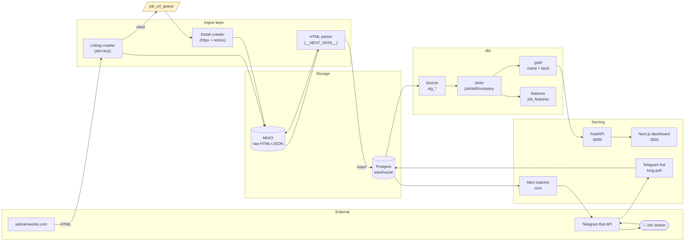
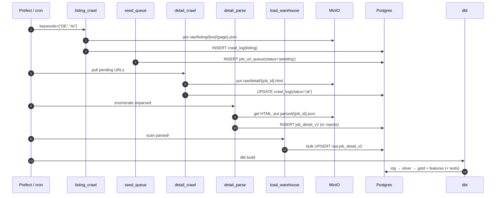
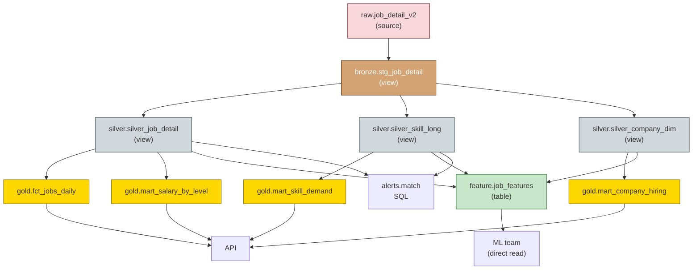
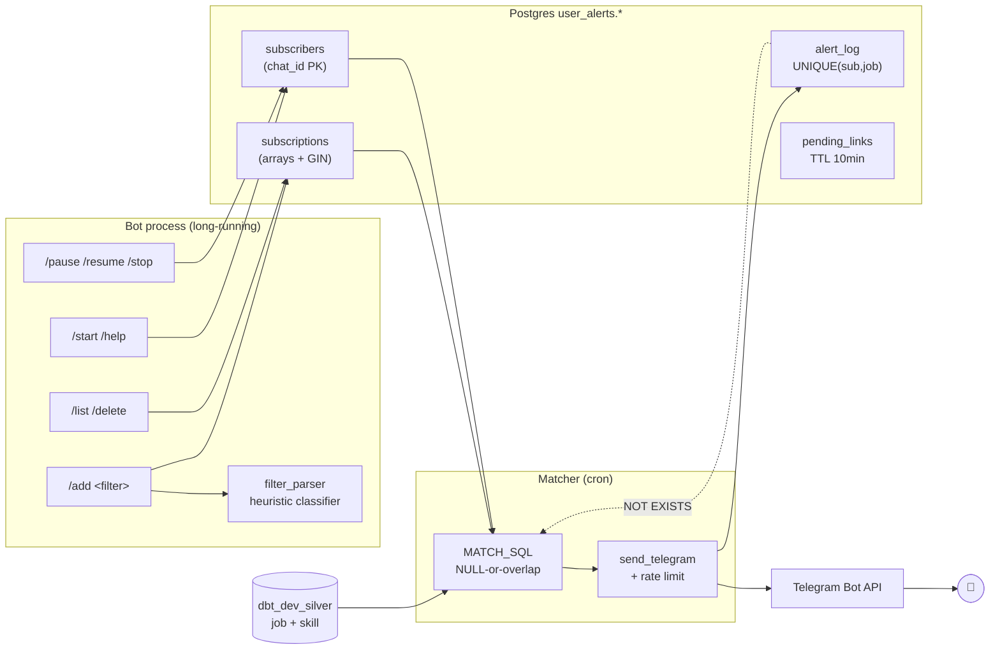
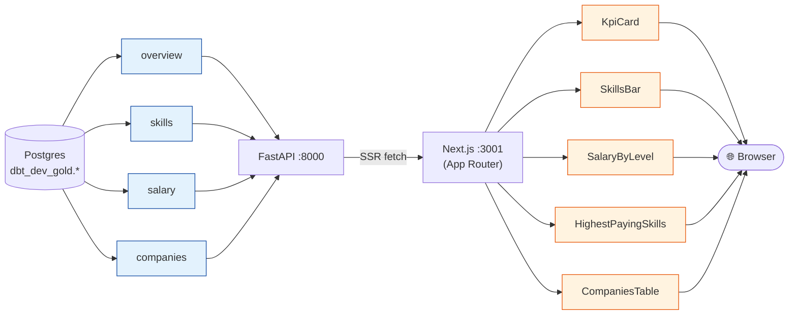
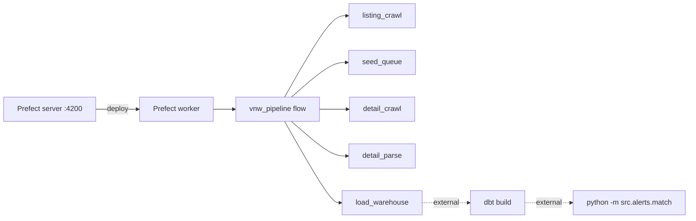
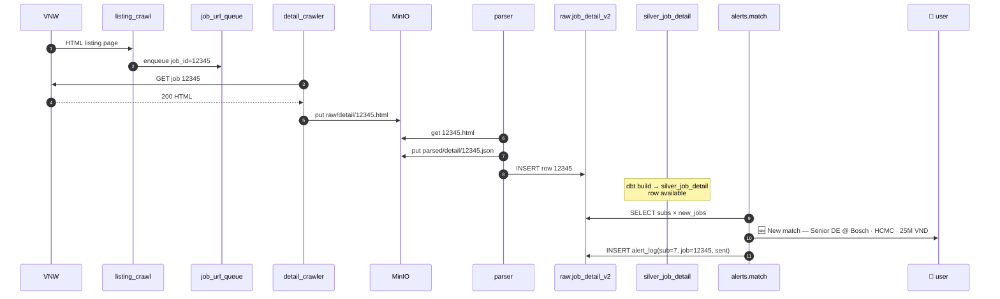

# TalentPulse — System Overview

End-to-end view of the VietnamWorks DE/AI job pipeline, from raw HTML on a third-party
site all the way to a Telegram DM in a job seeker's pocket.

> All diagrams below are [Mermaid](https://mermaid.js.org/) — GitHub renders them
> natively. For local viewing use VS Code "Markdown Preview Mermaid Support".

---

## 1. The 30-second pitch

> **Crawl** VietnamWorks → **Store raw** in MinIO → **Parse** HTML to JSON →
> **Load** to Postgres → **Transform** with dbt (bronze → silver → gold + features) →
> **Serve** via FastAPI/Next.js dashboard + Telegram alerts to end users.

7 layers, 1 Postgres, 1 MinIO, ~50 dbt tests, 91 pytest tests, 1 cron-driven matcher.

---

## 2. Top-level architecture



**Two control flows**:
- **Pipeline flow** (left → right, batch, scheduled): crawl → store → parse → load → dbt
- **Alert flow** (post-dbt, event-ish): match → DM user

---

## 3. Repo map

```
pipeline_data/
├─ src/
│  ├─ crawlers/vietnamworks/    listing.py + detail/
│  ├─ parsers/vietnamworks/     detail/  → HTML → JSON
│  ├─ queue/seeder.py           seed pending jobs from listings
│  ├─ loaders/                  job_detail_loader.py + validators.py
│  ├─ storage/                  minio_client + crawl_log + job_detail_repo
│  ├─ telegram_bot/             bot.py + filter_parser.py        ← user-facing
│  ├─ alerts/                   match.py                         ← cron job
│  └─ utils/
├─ dbt_transform/models/
│  ├─ bronze/   stg_job_detail
│  ├─ silver/   silver_job_detail | silver_skill_long | silver_company_dim
│  ├─ gold/     fct_jobs_daily | mart_salary_by_level | mart_skill_demand
│  │           | mart_company_hiring
│  └─ features/ job_features                                     ← ML-ready
├─ orchestration/flows/         vnw_pipeline.py (Prefect)
├─ migrations/                  001_user_alerts_schema.sql
├─ tests/                       91 pytest (incl. 51 alerts/bot)
└─ docs/                        contracts, design notes, this doc
```

---

## 4. Data flow — pipeline (crawl → warehouse)



**Idempotency guarantees** (each step safe to rerun):

| Step | Key | Mechanism |
|---|---|---|
| listing | `(keyword, page, run_date)` | crawl_log unique |
| detail | `source_job_id` | crawl_log unique + MinIO key dedup |
| parse | `minio_key` | overwrite parsed JSON, ON CONFLICT in DB |
| load | `source_job_id` | UPSERT into raw.job_detail_v2 |
| dbt | model = view/table | recreated each run |
| alerts | `(subscription_id, source_job_id)` | UNIQUE in alert_log |

---

## 5. Warehouse layers (dbt lineage)



| Layer | Materialization | Purpose | Schema |
|---|---|---|---|
| `raw.*` | source | landed by loaders, no dbt | `raw` |
| bronze | view | type-cast + light cleanup | `dbt_dev_bronze` |
| silver | view | business entities, dedup, normalization | `dbt_dev_silver` |
| gold | table | BI-ready aggregates | `dbt_dev_gold` |
| features | table | ML feature store, entity-grain | `dbt_dev_feature` |

---

## 6. Alert subsystem — user-facing Telegram



### Filter grammar (in `/add`)

| Token shape | Bucket | Examples |
|---|---|---|
| city alias | `cities` | `hcmc`, `saigon`, `tphcm`, `hanoi`, `hn`, `danang`, `dn` |
| level alias | `job_levels` | `intern`, `fresher`, `entry`, `junior`, `senior`, `lead`, `manager` |
| number + suffix | `min_salary_vnd` | `20m`, `25M`, `30tr`, `500k`, `1b`, `15.5m` |
| bare number 1–10000 | `min_salary_vnd` (× 10⁶) | `20` → 20,000,000 |
| else | `skills` | `python`, `airflow`, `dbt` |

### Per-dimension filter operators

| Sub column | SQL | Semantics |
|---|---|---|
| `skills text[]` | `sub.skills && j.skills` | overlap (any-match) |
| `cities`, `job_levels`, `companies` | `j.col = ANY(sub.col)` | exact-match in canonical |
| `min_salary_vnd` | `j.salary >= sub.min_salary_vnd` | floor; null salaries excluded |

`NULL` on any sub column means "no filter on that dimension".

---

## 7. Serving layer (dashboard)



`metabase_ro` Postgres role is the read-only principal for both Metabase (dev) and the
dashboard backend. `dbt_dev_gold.*` is the only "public" surface — bronze/silver are
internal.

---

## 8. Orchestration



**Slim deploy alternative** (2 GB VPS, no Prefect): replace with a `systemd` timer that
chains `vnw_pipeline → dbt build → alerts.match`. See `docs/cron_replacement.md` (in
the dashboard repo) for the unit files.

---

## 9. Storage layout

### MinIO buckets (`talentpulse-raw`)
```
raw/
  listing/{keyword}/{YYYY-MM-DD}/page-{n}.json
  detail/{source_job_id}.html
parsed/
  detail/{source_job_id}.json
```

### Postgres schemas
| Schema | Owner | Contents |
|---|---|---|
| `raw` | admin | landed tables (`crawl_log`, `job_url_queue`, `job_detail_v2`, `job_detail_rejects`) |
| `dbt_dev_bronze` | admin | `stg_job_detail` |
| `dbt_dev_silver` | admin | `silver_job_detail`, `silver_skill_long`, `silver_company_dim` |
| `dbt_dev_gold` | admin | `fct_jobs_daily`, `mart_*` |
| `dbt_dev_feature` | admin | `job_features` |
| `user_alerts` | admin | `subscribers`, `subscriptions`, `alert_log`, `pending_links` |
| `metabase_app` | admin | Metabase's own state (separate logical DB) |

`metabase_ro` has SELECT on bronze/silver/gold/feature/user_alerts.

---

## 10. Operational matrix

| Concern | Where it lives | Mechanism |
|---|---|---|
| Crawler politeness | `listing.py` / `detail_crawler.py` | jittered sleep + UA + crawl_log dedup |
| Schema validation | `loaders/validators.py` | Pydantic v2 → reject row → `job_detail_rejects` |
| Data quality tests | `dbt_transform/models/**/*_tests.yml` | 50+ dbt tests (not_null, unique, accepted_range) |
| Code tests | `tests/` | 91 pytest (asyncio_mode=auto) |
| Idempotency | every layer | natural keys + UNIQUE constraints + UPSERT |
| Backpressure | crawler queue | `job_url_queue.status` = pending/in_progress/done |
| Rate limiting | alert matcher | per-chat 1.1 s sleep, MAX_ALERTS_PER_USER cap |
| Secrets | `.env` (gitignored) | DB pw, MinIO keys, `TELEGRAM_BOT_TOKEN` |
| Lineage | dbt | `dbt docs generate && dbt docs serve` (see `docs/lineage.md`) |
| BI access | `metabase_ro` role | SELECT-only across analytical schemas |

---

## 11. End-to-end happy path (one job)



That single row took 5 idempotent hops, sat in 3 storage layers, was tested by ~10
dbt assertions, and finally landed in a Telegram DM. If anything fails, the
upstream artifact is on disk and rerunning the next stage just picks up where the
last one stopped.

---

## 12. Where to read next

| Topic | File |
|---|---|
| Crawler contract (URLs, headers, retry) | `docs/06-crawler-listing-pages.md`, `07-crawler-detail-pages.md` |
| Parser contract | `docs/08-parser-contract.md` |
| Normalized schema + skill taxonomy | `docs/09-normalized-schema.md`, `12-skill-taxonomy-v1.md` |
| Data quality | `docs/17-data-quality.md`, `data_audit.md` |
| Orchestration | `docs/orchestration_setup.md`, `16-orchestration-dag.md` |
| Lineage / dbt docs | `docs/lineage.md` |
| Feature store | `docs/feature_store.md` |
| Telegram alerts | `docs/telegram_alerts.md` |
| Metabase setup | `docs/metabase_setup.md` |
| Dashboard (separate repo) | `D:/TalentPulse/dashboard/README.md` |
